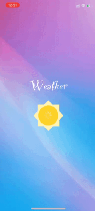

# Educational project with weather forecast app

   
   
   

## ✍️ About

Pet-project Weather shows current weather data or weather forecast for tomorrow or five days, at your location or in any city of your choice. Weather data comes via API from openweathermap.org

## 📺 Demo

## 💪 Skill training
- MVVM-C
- REST API
- JSON
- Realm
- GCD

## 🖥 How to build
- Clone the repository
- $ git clone https://github.com/Bogatchuk/Weather.git
- Install pods
- $ cd Weather
- $ pod install
- Open the workspace in Xcode
- $ open "Weather.xcworkspace"

Compile and run the app in your simulator

If you don't see any data, please check "Simulator" -> "Debug" -> "Location" to change the location.

## Developers

- [Bogatchuk Roman](https://github.com/Bogatchuk)

## Requirements
- Xcode 14
- iOS 14+
- Swift 5
